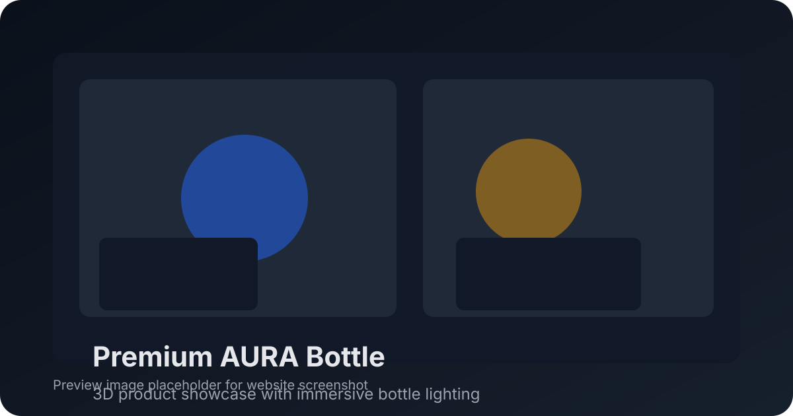

# Premium AURA Bottle 3D Landing Page

A premium-quality 3D landing page built with Vite and Three.js, designed to showcase a luxury bottle concept in a cinematic web presentation.



## Overview

This project demonstrates a polished landing experience with immersive 3D visuals, animated scene controls, and responsive layout support. The current implementation uses `three` for rendering the 3D bottle scene and Vite for fast development and optimized production builds.

## Features

- 3D bottle scene powered by `three`
- Smooth interactions and scroll-triggered transitions
- Lightweight Vite-powered development workflow
- Clean, modern landing page structure
- Responsive design ready for desktop and large-screen hero layouts

## Setup

```bash
npm install
npm run dev
```

Open the local URL shown by Vite to preview the landing page.

## Build

```bash
npm run build
```

This generates an optimized production bundle for deployment.

## Project Structure

- `index.html` — root redirect to the app entry
- `package.json` — package metadata and scripts
- `favicon.svg` — site favicon asset
- `screenshot.svg` — preview image placeholder used by README
- `path/` — application source files for scene, UI, and styles

## Notes

The current setup is private and ready for customization, such as adding product copy, calls to action, or backend integration for a campaign landing page.
